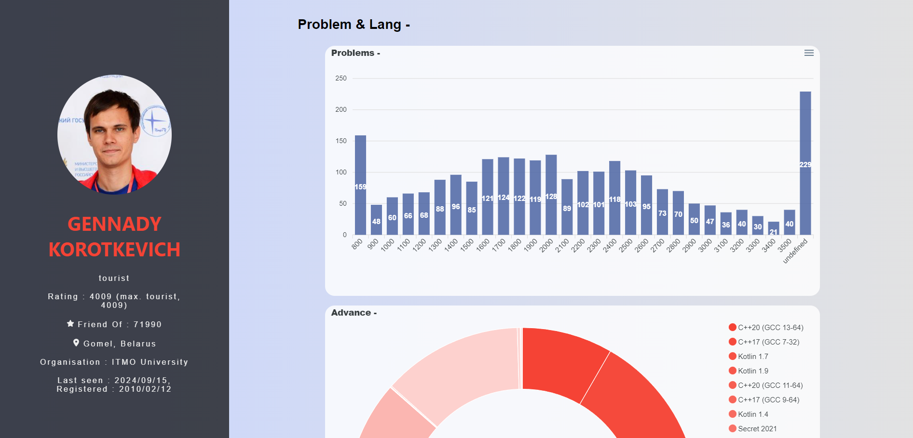
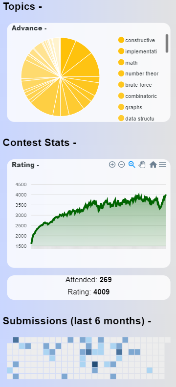
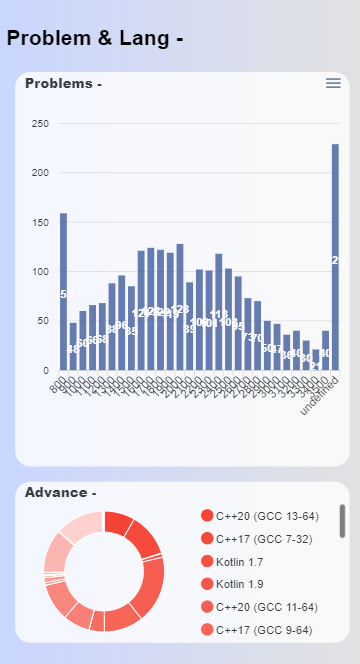

# 📊 **LeetCode & Codeforces Stats Visualizer**  
  
  
  


## 🌐 **Overview**
A **React.js** website that provides detailed visualizations of user stats from **LeetCode** and **Codeforces**.  
With this platform, users can enter their usernames and view their coding stats like **solved problems**, **rank progression**, and **hidden metrics** in a single place. The data is displayed in interactive graphs and charts using **ApexCharts**, enhancing the user experience. All data is fetched from the respective **LeetCode** and **Codeforces** APIs.

### Key Features:
- 📊 **Visualize LeetCode & Codeforces Data:** Get user-specific data and metrics at a glance.
- ⚡ **Interactive Graphs:** Easy-to-read, dynamic graphs built with **ApexCharts**.
- 🔍 **Hidden Metrics:** Explore stats that are not directly available on LeetCode/Codeforces.
- 🚀 **React.js Frontend:** Fast and responsive website built using the power of **React.js**.
- 🔗 **API Integration:** Fetch live data using the public APIs of **LeetCode** and **Codeforces**.

---

## 🚀 **Demo**
🔗 [Live Demo](https://dashboard-dsa.netlify.app/)  



---

## 🛠 **Tech Stack**
  
  


- **Frontend:** React.js
- **Charts & Graphs:** ApexCharts.js
- **API Integration:** Fetching data from LeetCode & Codeforces APIs

---

## 📦 **Installation**

To run this project locally:

1. Clone the repo:
   ```bash
   git clone https://github.com/yourusername/yourprojectname.git

2. Navigate to the project directory:
   ```bash
   cd yourprojectname

3. Install dependencies
   ```bash
   npm install
   
4. Start the development server
   ```bash
   npm start

---

## 🖥️ **Usage**

1. Visit the website.
2. Enter a valid **LeetCode** or **Codeforces** username in the input field.
3. View the user’s data visualized in beautiful charts!

---

## 📈 **Sample Graphs**

Here's a glimpse of how the data looks in the visualizer:




---

## 🧑‍💻 **Contributing**

Contributions are welcome! To contribute:

1. Fork the repository.
2. Create a new branch (`git checkout -b feature/your-feature`).
3. Commit your changes (`git commit -m 'Add some feature'`).
4. Push to the branch (`git push origin feature/your-feature`).
5. Open a Pull Request.

---

## 📄 **License**

This project is licensed under the MIT License. See the [LICENSE](LICENSE) file for details.

---

## 📞 **Contact**

If you have any questions or feedback, feel free to reach out:

- Email: im.om.chaudhary@gmail.com
